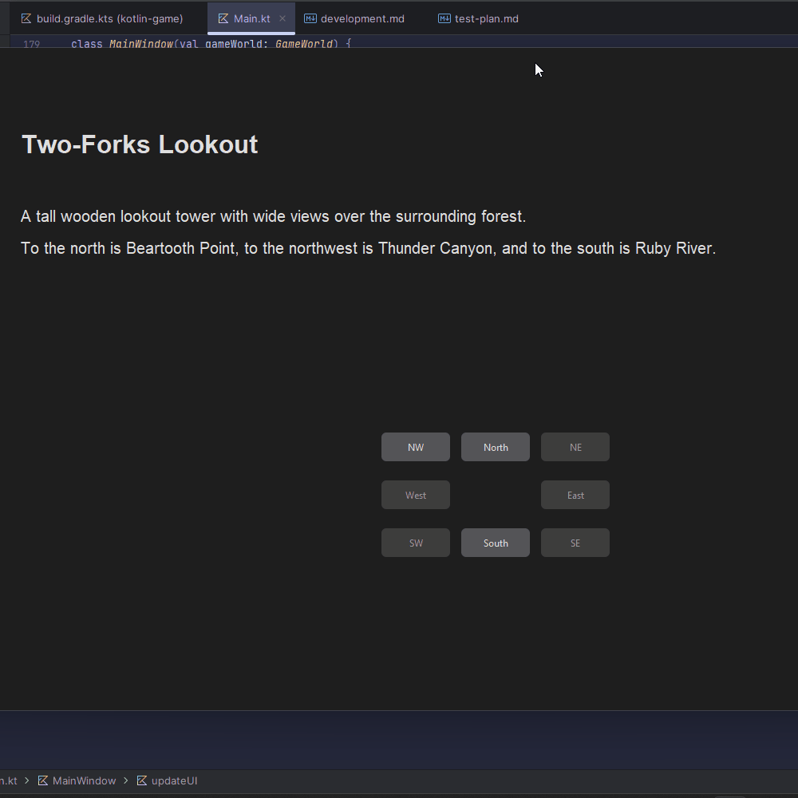
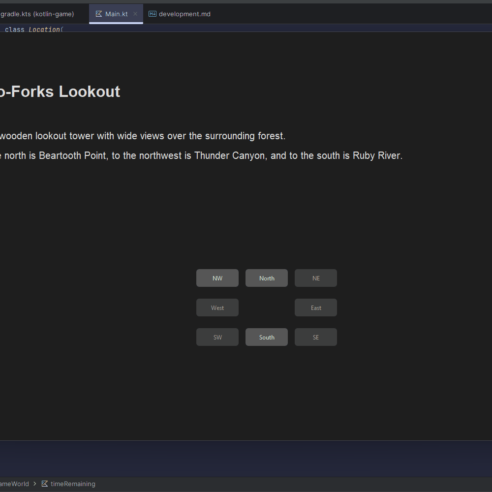
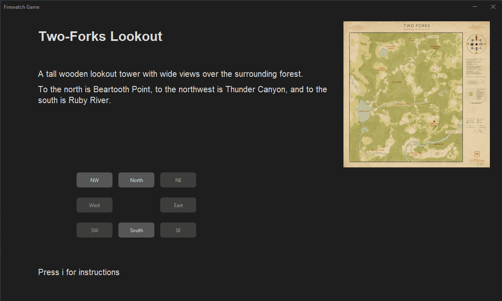

# Development Log

The development log captures key moments in your application development:

- **Design ideas / notes** for features, UI, etc.
- **Key features** completed and working
- **Interesting bugs** and how you overcame them
- **Significant changes** to your design
- Etc.

---

## Date: 19/04/2026

Player can move between locations 

---

## Date: 24/04/2026

Players movement is restricted if they don't have the required item.

---

## Date: 29/04/2026

If the player doesn't extinguish the fire before the timer runs out then the game ends

---

## Date: 7/05/2026

I realised that required items can spawn in locations that need a required item to get to,
to solve this i removed a required item (the raft) which also allows freer movement for the user. 

---

