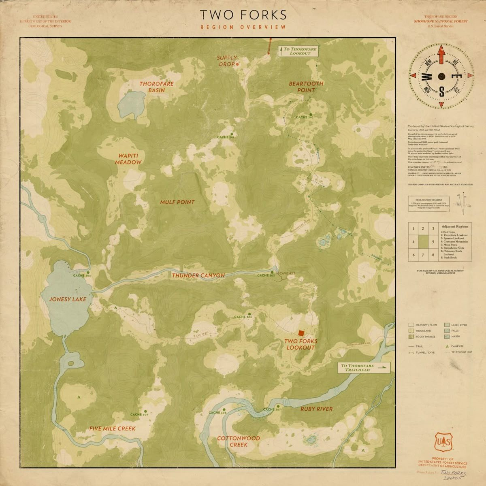
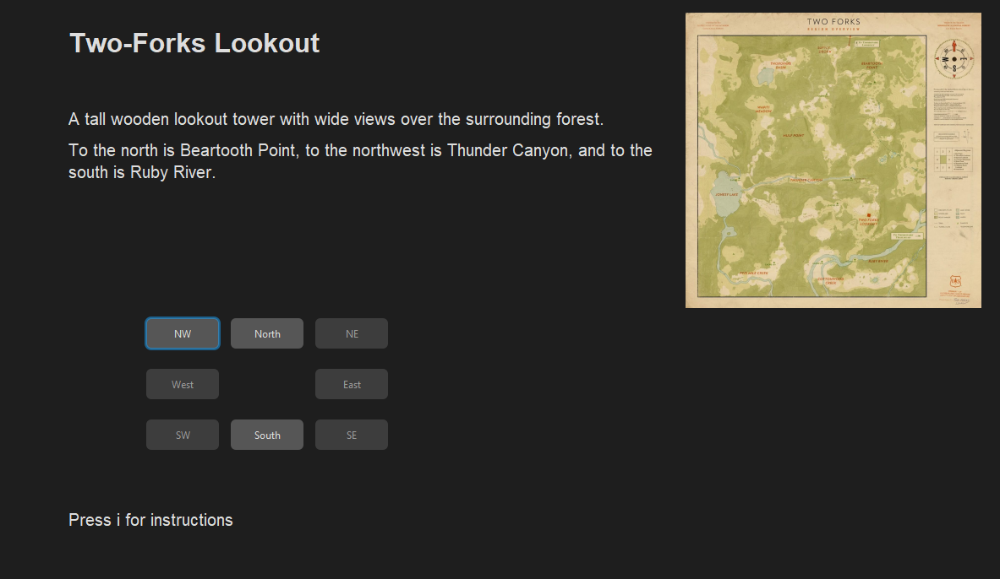
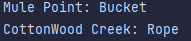
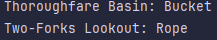
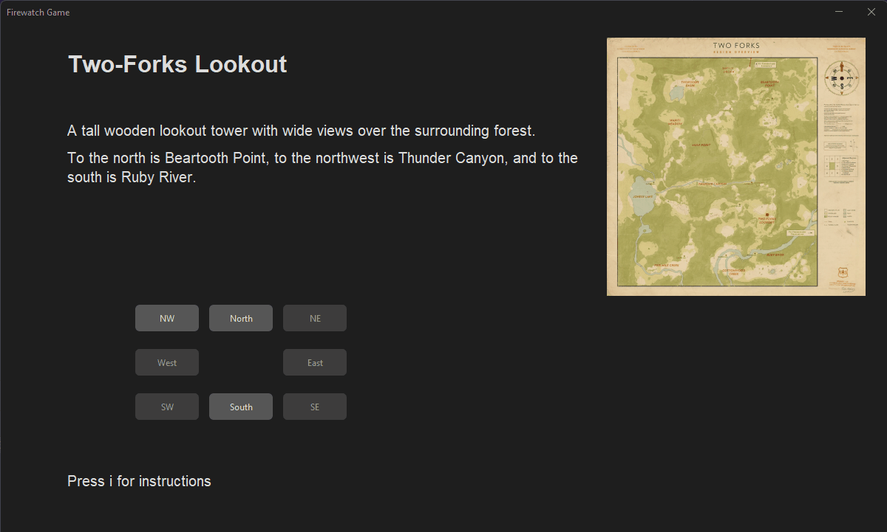

# Results of Testing

The test results show the actual outcome of the testing, following the [Test Plan](test-plan.md)

---

## The Map used in game. 

## Does the game set up properly? 

The game should run and set the user to be at Two Forks lookout

### Test Data Used

Run the game 

### Test Result

The player spawned at the correct location. 

---

## Do the items spawn randomly?

The game should run and spawn the items randomly

### Test Data Used

Run the game twice while printing the items to the console 

### Test Result

The items were at random locations (The first picture was the first time and the second picture was the second test.)

---

## Valid movements 

When the user presses a valid button does the location change?

### Test Data Used

I am going to travel around the map through a couple of locations 

### Test Result

When valid buttons were pressed the location updated like it was supposed to. 

---

## Boundary Movements 

If the user goes to the edge of the map can they go off the edge of it? Or does the game break? 

### Test Data Used

Going to boundary locations on the map 

### Test Result

When I went to the boundary the game didn't break and didn't allow them to fall off the map. 

---

## Invalid Movements

If the user tries to move to a location that isn't connected or shouldn't be allowed, does the game move?

### Test Data Used

Go to the edge of the map and try move off it 

### Test Result

As the buttons are disabled when a move is not possible the game did not allow any invalid movement. 

---

## Is the game winable? 

Once the user fills the bucket and finds the fire do they win the game? 

### Test Data Used

Winning the game 

### Test Result

Yes. The player successfully won the game.  

---

## Is the game losable? 

Can the user run out of time if they take too long?  

### Test Data Used

Allowing the timer to reach 0  

### Test Result

The player lost the game. 

---

## Can the player pick up items?

When the user travels to a location with an item at it do they pick it up? 

### Test Data Used

Find a location with an item 

### Test Result

The player picked up the item 

---

